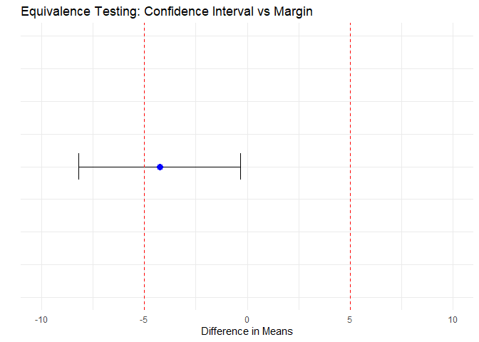

# Equivalence Testing Overview {.unnumbered}

In many fields of pharmaceutical and biotechnological research, including biosimilar development, the goal is not to demonstrate a difference between two products, but rather to show that they are *sufficiently similar*.
This leads us to the concept of **equivalence testing**, which aims to statistically verify that any difference between two treatments is small enough to be considered negligible within a pre-specified margin.

## Why Equivalence Matters in Biosimilar Development {.unnumbered}

Unlike traditional hypothesis testing—where the null hypothesis assumes no difference—equivalence testing reverses the logic:

-   **Null Hypothesis (H₀):** The two treatments are *not equivalent*, i.e., the difference exceeds the acceptable margin.
-   **Alternative Hypothesis (H₁):** The treatments are *equivalent*, i.e., the difference lies within the predefined equivalence margin.

This approach is critical in biosimilar development, where regulatory agencies (e.g., FDA, EMA) require evidence that the biosimilar is neither inferior nor superior beyond a certain threshold relative to the reference product.

## The Problem with Traditional t-tests {.unnumbered}

A common misconception is that a *non-significant result* in a traditional t-test implies equivalence.
However, this is incorrect.
A non-significant p-value simply indicates insufficient evidence to claim a difference—it does *not* confirm similarity.

To formally assess equivalence, we need a dedicated method: the **Two One-Sided Tests (TOST) procedure**.

## Introducing TOST (Two One-Sided Tests) {.unnumbered}

TOST evaluates whether the true difference between two treatments falls entirely within an equivalence interval.

The procedure involves two one-sided hypothesis tests:

1.  Test if the treatment difference is **greater than the lower bound** (i.e., not too small).
2.  Test if the treatment difference is **less than the upper bound** (i.e., not too large).

Only if **both** tests are statistically significant (p \< α), equivalence is concluded.

This method directly aligns with regulatory guidelines and is considered a gold standard for equivalence assessment.

## Visualizing Equivalence {.unnumbered}

A helpful way to understand equivalence testing is through confidence intervals.
If the entire 90% or 95% confidence interval of the treatment difference lies *within* the equivalence bounds, equivalence is supported.

> **Note**: Equivalence bounds must be pre-specified based on clinical relevance or regulatory guidance.

## Summary {.unnumbered}

| Test Type | Null Hypothesis H₀ | Alternative H₁     | When Used?                 |
|-----------|--------------------|--------------------|----------------------------|
| t-test    | No difference      | Difference (Δ ≠ 0) | To detect differences      |
| TOST      | Not equivalent     | Equivalent         | To demonstrate equivalence |

In the next chapter, we will explore the **mathematical formulation of TOST** and implement it in R, comparing it with traditional t-tests to highlight key differences in interpretation.

<!--chapter:end:index.Rmd-->

# Author  {-}

My name is Kyungmin In, and I am the head of the Research Unit at **GCCL** (https://eng.gccl.co.kr/). I have worked as a bioanalytical team leader for many years at several companies, where I have led **method development, validation, and regulated bioanalysis** for both clinical trials and nonclinical studies. My academic background includes a Ph.D. in molecular biology, with additional studies in immunology. During my Ph.D. in Germany, I focused on researching rare genetic diseases.

I have direct experience in the **development and analytical validation of biosimilar products**, including **comparability studies, ADA (anti-drug antibody) assays, and bioequivalence assessments**, which are relevant to this book’s focus on **equivalence testing**.

I am particularly interested in automation and reproducible data generation and analysis for bioanalysis, which has led me to explore tools like **R** for statistical analysis and reporting. Additionally, I have experience using commercial systems like **Watson LIMS** (Thermo Fisher Scientific) for efficient data management and analysis in compliance with regulatory standards.


<!--chapter:end:00-Authour.Rmd-->

# Chapter 1: Mathematical Comparison: t-test vs TOST {.unnumbered}

## 1. t-test: Testing for Difference {.unnumbered}

In a standard *two-sample t-test*, we assess:

-   **Null Hypothesis (H₀):** μ₁ = μ₂ (no difference)
-   **Alternative (H₁):** μ₁ ≠ μ₂ (there is a difference)

The test statistic:

$$
t = \frac{\bar{X}_1 - \bar{X}_2}{s_p \cdot \sqrt{\frac{1}{n_1} + \frac{1}{n_2}}}
$$

with pooled standard deviation $s_p$, follows a *t-distribution*. We reject H₀ if $|t| > t_{α/2}$.

**Key limitation**: If p \> 0.05, it only means *no evidence of difference*, not *evidence of similarity*.

------------------------------------------------------------------------

## 2. TOST: Testing for Equivalence {.unnumbered}

In TOST, we define **equivalence bounds**: $[-Δ, +Δ]$, where Δ is the *maximum acceptable difference*.

TOST is performed:

1.  $H₀: μ₁ - μ₂ ≤ -Δ$ vs $H₁: μ₁ - μ₂ > -Δ$
2.  $H₀: μ₁ - μ₂ ≥ +Δ$ vs $H₁: μ₁ - μ₂ < +Δ$

We reject both H₀’s if the **(1–2α) confidence interval** for $μ₁ - μ₂$ is *entirely within* $[-Δ, +Δ]$.

> Visualization: Equivalence is demonstrated if the CI ⊂ [-Δ, +Δ]

------------------------------------------------------------------------

### Summary of Logic {.unnumbered}

| Feature      | t-test                   | TOST                         |
|--------------|--------------------------|------------------------------|
| Goal         | Detect a difference      | Confirm similarity           |
| H₀           | μ₁ = μ₂                  | \|μ₁ – μ₂\| \> Δ             |
| CI threshold | CI excludes 0            | CI fully within [-Δ, +Δ]     |
| Conclusion   | Difference exists or not | Equivalence confirmed or not |

## 3. Simulation: t-test vs TOST {.unnumbered}

We conducted 10,000 simulations across a range of sample size (n = 2 to 100 ) to evaluate the following:

-   Random sampling from **two groups with different means**
-   Comparison of those sample means to determine **whether a difference is detected**
-   The **correct conclusion** in all cases: tho tow group means **are different**.

Estimation of the **probability of a correct conclusion**, defined as **correctly identifying that the two group means are different**, using two statistical approaches: **t-test** and **TOST**

### Key Results {.unnumbered}


-   **t-test**: Designed to detected differences, but in simulations, it often **fails to detect small true difference when sample size increases**, leading to a **false sense of equivalence**. This effect worsens as the sample size increases due to narrowing confidence intervals **centered near zero**, especially when the true difference is small.

-   **TOST**: Designed to test for equivalence. As sample size increases, TOST becomes **more likely to correctly reject equivalence when the means differ**, reaching **near-perfect accuracy** beyond **n ≈ 60**.

> **Insight**: A non-significant t-test does not imply equivalence. In fact, t-test becomes **less reliable at detecting small true differences as sample size increases**, while **TOST correctly rejects equivalence with increasing sample size. Equivalence requires a dedicated test, and TOST fulfills that purpose**.

------------------------------------------------------------------------

## 4. Code used for the Simulation {.unnumbered}


``` r
library(parallel)

# Parallelized t.test simulation
sim_ttest <- function(target_n, g1, g2, reps = 10000) {
  cl <- makeCluster(detectCores() - 1)
  clusterExport(cl, varlist = c("g1", "g2", "reps"), envir = environment())
  n_vec <- 2:target_n
  results <- parSapply(cl, n_vec, function(i) {
    mean(replicate(reps, {
      g1.s <- sample(g1, i)
      g2.s <- sample(g2, i)
      t.test(g1.s, g2.s)$p.value > 0.05
    }))
  })
  stopCluster(cl)
  data.frame(n = n_vec, probability = results * 100)
}

# Parallelized TOST-like CI check
sim_tost <- function(target_n, g1, g2, margin, reps = 10000) {
  cl <- makeCluster(detectCores() - 1)
  clusterExport(cl, varlist = c("g1", "g2", "margin", "reps"), envir = environment())
  n_vec <- 2:target_n
  results <- parSapply(cl, n_vec, function(i) {
    mean(replicate(reps, {
      g1.s <- sample(g1, i)
      g2.s <- sample(g2, i)
      diff <- mean(g2.s) - mean(g1.s)
      sd1 <- sd(g1.s)
      sd2 <- sd(g2.s)
      se <- sqrt(sd1^2 / i + sd2^2 / i)
      df <- ((sd1^2 / i + sd2^2 / i)^2) /
            ((sd1^4) / ((i - 1) * i^2) + (sd2^4) / ((i - 1) * i^2))
      t_crit <- qt(0.95, df)
      lci <- diff - t_crit * se
      uci <- diff + t_crit * se
      (lci > -margin) & (uci < margin)
    }))
  })
  stopCluster(cl)
  data.frame(n = n_vec, probability = results * 100)
}


# Set seed and simulate
set.seed(0815)
g1 <- rnorm(1000, 0.8987491, 0.3197588)
g2 <- rnorm(1000, 1.098018, 0.4273691)
margin <- 1.5 * sd(g1)

result_ttest <- sim_ttest(100, g1, g2)
result_tost <- sim_tost(100, g1, g2, margin)

# Combine and plot
library(ggplot2)
result_ttest$method <- "t.test"
result_tost$method <- "equivalence.test"
df_plot <- rbind(result_ttest, result_tost)

ggplot(df_plot, aes(n, probability, color = method)) +
  geom_point(alpha = 0.5) + geom_line() +
  theme_bw() + xlab("Sample size (n)") +
  ylab("Correct conclusion probability (%)") +
  ggtitle("Comparison of t-test vs Equivalence Test (TOST logic)")
```

<!--chapter:end:01-ttestvstost.Rmd-->

# Chapter 2: Application of TOST in R {.unnumbered}

In this chapter, we demonstrate how to apply the **TOST** procedure using R. We will use the `TOSTER` package, which provides user-friendly functions for equivalence testing.

## Example Scenario {.unnumbered}

Suppose we are comparing the mean response of two treatment groups in a biosimilar study. We aim to determine whether the observed difference in means is small enough to be considered **clinically negligible**, i.e., within a pre-specified **equivalence margin**.

Let’s assume:

-   Group 1 (Test): Mean ≈ 100, SD ≈ 10
-   Group 2 (Reference): Mean ≈ 102, SD ≈ 10
-   Equivalence margin = ±5 units

------------------------------------------------------------------------

### Step 1: Simulated Data {.unnumbered}


``` r
set.seed(123)
group1 <- rnorm(30, mean = 100, sd = 10)
group2 <- rnorm(30, mean = 102, sd = 10)

summary(group1)
```

```
##    Min. 1st Qu.  Median    Mean 3rd Qu.    Max. 
##   80.33   93.29   99.26   99.53  104.89  117.87
```

``` r
summary(group2)
```

```
##    Min. 1st Qu.  Median    Mean 3rd Qu.    Max. 
##   86.51   98.97  102.48  103.78  109.57  123.69
```

------------------------------------------------------------------------

### Step 2: Traditional t-test (for comparison) {.unnumbered}


``` r
t.test(group1, group2)
```

```
## 
## 	Welch Two Sample t-test
## 
## data:  group1 and group2
## t = -1.8087, df = 56.559, p-value = 0.07581
## alternative hypothesis: true difference in means is not equal to 0
## 95 percent confidence interval:
##  -8.9654261  0.4565843
## sample estimates:
## mean of x mean of y 
##  99.52896 103.78338
```

The p-value \> 0.05 does **not confirm equivalence**, only that no significant difference was found.

------------------------------------------------------------------------

### Step 3: TOST Analysis with TOSTER {.unnumbered}

We now perform TOST with equivalence bounds of -5 and +5 units.


``` r
library(TOSTER)

TOST_result <- TOSTtwo.raw(m1 = mean(group1),
                           m2 = mean(group2),
                           sd1 = sd(group1),
                           sd2 = sd(group2),
                           n1 = length(group1),
                           n2 = length(group2),
                           low_eqbound = -5,
                           high_eqbound = 5,
                           alpha = 0.05)
```

<!-- -->

```
## TOST results:
## t-value lower bound: 0.317 	p-value lower bound: 0.376
## t-value upper bound: -3.93 	p-value upper bound: 0.0001
## degrees of freedom : 56.56
## 
## Equivalence bounds (raw scores):
## low eqbound: -5 
## high eqbound: 5
## 
## TOST confidence interval:
## lower bound 90% CI: -8.188
## upper bound 90% CI:  -0.321
## 
## NHST confidence interval:
## lower bound 95% CI: -8.965
## upper bound 95% CI:  0.457
## 
## Equivalence Test Result:
## The equivalence test was non-significant, t(56.56) = 0.317, p = 0.376, given equivalence bounds of -5.000 and 5.000 (on a raw scale) and an alpha of 0.05.
```

```
## 
```

```
## 
## Null Hypothesis Test Result:
## The null hypothesis test was non-significant, t(56.56) = -1.809, p = 0.0758, given an alpha of 0.05.
```

```
## 
```

```
## NHST: don't reject null significance hypothesis that the effect is equal to 0 
## TOST: don't reject null equivalence hypothesis
```

``` r
print(TOST_result)
```

```
## $diff
## [1] -4.254421
## 
## $TOST_t1
## [1] 0.3169703
## 
## $TOST_p1
## [1] 0.3762166
## 
## $TOST_t2
## [1] -3.934361
## 
## $TOST_p2
## [1] 0.0001152633
## 
## $TOST_df
## [1] 56.55858
## 
## $alpha
## [1] 0.05
## 
## $low_eqbound
## [1] -5
## 
## $high_eqbound
## [1] 5
## 
## $LL_CI_TOST
## [1] -8.187882
## 
## $UL_CI_TOST
## [1] -0.3209598
## 
## $LL_CI_TTEST
## [1] -8.965426
## 
## $UL_CI_TTEST
## [1] 0.4565843
## 
## $NHST_t
## [1] -1.808695
## 
## $NHST_p
## [1] 0.075815
```

### Interpretation {.unnumbered}

-   If both one-sided p-values \< 0.05, equivalence is concluded.
-   Check whether the **90% confidence interval** lies entirely within [-5, +5]

------------------------------------------------------------------------

### Step 4: Visualizing Equivalence {.unnumbered}


``` r
library(ggplot2)

diff <- mean(group1) - mean(group2)
se <- sqrt(sd(group1)^2/length(group1) + sd(group2)^2/length(group2))
ci <- c(diff - qt(0.95, df=length(group1)+length(group2)-2)*se,
        diff + qt(0.95, df=length(group1)+length(group2)-2)*se)

df_ci <- data.frame(lower = ci[1], upper = ci[2], mean_diff = diff)

ggplot(df_ci) +
  geom_errorbarh(aes(y = 1, xmin = lower, xmax = upper), 
                 height = 0.1,   # 
                 linewidth = 0.2) +
  geom_point(aes(y = 1, x = mean_diff), size = 3, color = "blue") +
  geom_vline(xintercept = c(-5, 5), linetype = "dashed", color = "red", linewidth = 0.5) +
  xlim(-10, 10) +
  ylim(0.5, 1.5) +  
  labs(title = "Equivalence Testing: Confidence Interval vs Margin",
       x = "Difference in Means", y = "") +
  theme_minimal() +
  theme(axis.text.y = element_blank(),
        axis.ticks.y = element_blank())
```

<div class="figure">

<p class="caption">(\#fig:unnamed-chunk-6)Equivalence Testing: Confidence Interval vs Margin</p>
</div>

> The confidence interval does not lie within the red dashed lines (equivalence margin) and therefore equivalence is not supported.

------------------------------------------------------------------------

## Manual TOST in R {.unnumbered}

For education purpose, we replicate the TOST calculation **manually**, using the same data.

### Step 1: Mean difference and standard error {.unnumbered}


``` r
mean_diff <- mean(group1) - mean(group2)  
sd1 <- sd(group1)
sd2 <- sd(group2)
n1 <- length(group1)
n2 <- length(group2)
se_diff <- sqrt(sd1^2/n1 + sd2^2/n2)
```

------------------------------------------------------------------------

### Step 2: Degrees of freedom and critical t-value {.unnumbered}


``` r
# Welch-Satterthwaite approximation
df <- (sd1^2/n1 + sd2^2/n2)^2 / 
      ((sd1^4)/((n1-1)*n1^2) + (sd2^4)/((n2-1)*n2^2))

t_crit <- qt(0.95, df)  # For 90% CI 
```

------------------------------------------------------------------------

### Step 3: Confidence interval of the difference {.unnumbered}


``` r
lci <- mean_diff - t_crit * se_diff
uci <- mean_diff + t_crit * se_diff

cat("90% CI: [", round(lci, 2), ",", round(uci, 2), "]\n")
```

```
## 90% CI: [ -8.19 , -0.32 ]
```

------------------------------------------------------------------------

### Step 4: Compare CI to Equivalence Margins {.unnumbered}


``` r
margin <- 5
if (lci > -margin & uci < margin) {
  cat("Conclusion: Equivalence supported.\n")
} else {
  cat("Conclusion: Equivalence NOT supported.\n")
}
```

```
## Conclusion: Equivalence NOT supported.
```

> This manual approach yields the same conclusion as the TOSTER package.

------------------------------------------------------------------------

### Summary Table {.unnumbered}

| Metric                  | Value                                   |
|-------------------------|-----------------------------------------|
| Mean difference         | -4.25                 |
| 90% Confidence Interval | [-8.19 ; -0.32] |
| Equivalence Margin      | ±5                             |
| Equivalence Conclusion  | Not equivalent based on CI              |

<!--chapter:end:02-PracticalApplication.Rmd-->

# Chapter 3: Analytical Similarity for Potency Assay Using TOST {.unnumbered}

## Limitation of `TOSTER` package in R {.unnumbered}

While the `TOSTER` package offers a convenient and user-friendly way to conduct equivalence testing, it assumes equal variances by default and does not support flexible adjustments for unequal sample sizes or variance heterogeneity.

In real-world applications—particularly in biosimilar or analytical similarity studies—test and reference groups often differ in both size and variability. For example, the reference product may have a large, established data set with minimal variability, while the test product might be limited in size and exhibit different dispersion characteristics.

To account for these practical challenges, we implemented a custom function `tost_auto_var_equal()`, which:

-   Automatically checks variance equality using Levene’s test

-   Applies pooled or Welch-adjusted degrees of freedom as needed

-   Allows asymmetric sample sizes and includes RLD-based adjustments

-   Computes one-sided t-tests and confidence intervals consistent with the TOST framework

For this custom implementation, the following equations are used internally to compute the standard error, degrees of freedom, and confidence intervals, depending on the sample size and variance assumptions:

**Equal sample size and variance**

$$
SE_{\text{equal}} = \sqrt{ \frac{ \sigma_1^2 + \sigma_2^2 }{n} }
$$

$$
df_{\text{equal}} = n_1 + n_2 - 2
$$

$$
CI = \delta \pm t_{1-\alpha, df_{\text{equal}}} \times SE_{\text{equal}}
$$

**Unequal sample size and equal variance**

$$
s_p^2 = \frac{ (n_1 - 1)\sigma_1^2 + (n_2 - 1)\sigma_2^2 }{ n_1 + n_2 - 2 }
$$

$$
SE_{\text{pooled}} = \sqrt{ s_p^2 \left( \frac{1}{n_1} + \frac{1}{n_2} \right) }
$$

$$
df_{\text{pooled}} = n_1 + n_2 - 2
$$

$$
CI = \delta \pm t_{1-\alpha, df_{\text{pooled}}} \times SE_{\text{pooled}}
$$

**Unequal variance**

$$
SE_{\text{Welch}} = \sqrt{ \frac{\sigma_1^2}{n_1} + \frac{\sigma_2^2}{n_2} }
$$

$$
df_{\text{Welch}} = \frac{ \left( \frac{\sigma_1^2}{n_1} + \frac{\sigma_2^2}{n_2} \right)^2 }
{ \frac{ \sigma_1^4 }{ n_1^2 (n_1 - 1) } + \frac{ \sigma_2^4 }{ n_2^2 (n_2 - 1) } }
$$

$$
CI = \delta \pm t_{1-\alpha, df_{\text{Welch}}} \times SE_{\text{Welch}}
$$

| Symbol                   | Meaning                                       |
|--------------------------|-----------------------------------------------|
| $\delta$                 | Mean difference: $\bar{x}_1 - \bar{x}_2$      |
| $\sigma_1^2, \sigma_2^2$ | Sample variances (groups 1 and 2)             |
| $n_1, n_2$               | Sample sizes for test and reference groups    |
| $df$                     | Degrees of freedom                            |
| $t_{1-\alpha, df}$       | Critical t value at 90% CI (one-sided α=0.05) |

------------------------------------------------------------------------

## TOST in Real World Application {.unnumbered}

To demonstrate how the custom `tost_auto_var_equal()` function works in practice, we simulate a simple example of potency testing where the test product has fewer available samples than the reference product since in potency testing for lot release or comparability studies, it is common that **test samples are limited in number**, while **reference samples are more readily available**.  

Regulatory authorities, including the **US FDA**, permit the use of **TOST** to evaluate **analytical similarity**, even in the presence of sample size imbalance and variance heterogeneity, while allowing an excessively large RLD sample size can artificially narrow the confidence interval, leading to potentially biased conclusions regarding equivalence.  

To mitigate this, regulatory guidance and internal validation practices often recommend limiting the effective sample size of the reference group. One commonly used rule is to cap the RLD sample size at **1.5 times that of the test group**.

It is also common to use a margin of **±1.5 times the standard deviation of the reference group (SDref)**. This approach accounts for the **biological variability** of the assay and is widely accepted in practice (e.g., USP \<1033\>, bioassay validation guidelines), such as:


``` r
# Example margin based on SDref
sd_ref <- sd(group_ref)
margin <- 1.5 * sd_ref
```


Therefore we can create simulation data set and set the equivalence margin such as:


``` r
set.seed(123)

# Reference: ample supply
group_ref <- rnorm(30, mean = 100, sd = 2)

# Test: limited availability
group_test <- rnorm(20, mean = 99, sd = 2)
```

and


``` r
# Reference mean and SD
ref_mean <- mean(group_ref)
ref_sd <- sd(group_ref)

# Raw to ratio scale
margin_raw <- 1.5*ref_sd
```

We then apply the custom function to assess equivalence:


``` r
tost_auto_var_equal <- function(g1, g2, margin_raw, alpha = 0.05, var.equal = NULL) {

  # Sample sizes
  n1 <- length(g1)  # Test (e.g., biosimilar or new lot)
  n2 <- length(g2)  # Reference (e.g., RLD or existing lot)

  # Variance assumption: automatic or user-specified
  if (is.null(var.equal)) {
    combined <- data.frame(
      value = c(g1, g2),
      group = factor(rep(c("g1", "g2"), times = c(n1, n2)))
    )
    # Levene’s test (robust to non-normality)
    p_var <- car::leveneTest(value ~ group, data = combined)[1, "Pr(>F)"]
    var_equal <- p_var > 0.05
  } else {
    var_equal <- var.equal
    p_var <- NA
  }

  # Group means, variances, and difference (delta)
  mean1 <- mean(g1)
  mean2 <- mean(g2)
  var1 <- var(g1)
  var2 <- var(g2)
  delta <- mean1 - mean2

   # Standard error (SE) and degrees of freedom (df)
  if (var_equal && n1 == n2) {
    se_diff <- sqrt((var1 + var2) / n1)
    df <- n1 + n2 - 2
    message("Equal variance & equal sample size")
  } else if (var_equal && n1 != n2) {
    n2 <- min(1.5 * n1, n2)  # RLD adjustment
    se_pooled <- ((n1 - 1) * var1 + (n2 - 1) * var2) / (n1 + n2 - 2)
    se_diff <- sqrt(se_pooled * (1 / n1 + 1 / n2))
    df <- n1 + n2 - 2
    message("Equal variance & unequal sample size (RLD adjusted)")
  } else {
    if (n1 != n2) {
      n2 <- min(1.5 * n1, n2)  # RLD adjustment
      message("Unequal variance & unequal sample size (RLD adjusted)")
    } else {
      message("Unequal variance & equal sample size")
    }
    se_diff <- sqrt(var1 / n1 + var2 / n2)
    df_num <- (var1 / n1 + var2 / n2)^2
    df_den <- (var1^2 / (n1^2 * (n1 - 1))) + (var2^2 / (n2^2 * (n2 - 1)))
    df <- df_num / df_den
  }


  # TOST one-sided t.tests
  t1 <- (delta + margin_raw) / se_diff
  t2 <- (delta - margin_raw) / se_diff
  p1 <- pt(t1, df, lower.tail = FALSE)
  p2 <- pt(t2, df, lower.tail = TRUE)

  # 90% Confidence Interval
  t_crit <- qt(1 - alpha, df)
  ci_lower <- delta - t_crit * se_diff
  ci_upper <- delta + t_crit * se_diff
  ci_raw_diff <- paste0(round(ci_lower, 3), " – ", round(ci_upper, 3))
  ci_within_margin <- (ci_lower >= -margin_raw) & (ci_upper <= margin_raw)

  # Result table
  tibble::tibble(
    delta = delta,
    t1 = t1, p1 = p1,
    t2 = t2, p2 = p2,
    CI_lower = ci_lower,
    CI_upper = ci_upper,
    margin_used = round(margin_raw, 4),
    df = round(df, 2),
    variance_equal = var_equal,
    variance_test_p = p_var,
    variance_assumption = if (var_equal) {
      "Equal variance assumed (Levene’s test p > 0.05)"
    } else {
      "Unequal variance assumed (Levene’s test p <= 0.05, Welch’s df applied)"
    },
    pass_equivalence = (p1 < alpha) & (p2 < alpha)
  )
}
```

The custom function above automatically determines whether to assume equal or unequal variances via Levene’s test, applies the correct degrees of freedom (pooled or Welch-adjusted), and limits the effective reference sample size to 1.5× that of the test group to avoid artificially narrow confidence intervals.  
We can run the function and save the result as shown below: 


``` r
result_tost <- tost_auto_var_equal(
  g1 = group_test,
  g2 = group_ref,
  margin_raw = margin_raw 
)
```

```
## Equal variance & unequal sample size (RLD adjusted)
```

We can summarize the results with the following helper function:


``` r
summarize_tost_result <- function(result_tost) {
  cat("=== TOST Summary ===\n")
  cat("Difference (delta):", round(result_tost$delta, 4), "\n")
  cat("90% CI: [", round(result_tost$CI_lower, 4), ",", round(result_tost$CI_upper, 4), "]\n")
  cat("Equivalence margin: ±", round(result_tost$margin_used, 4), "\n")
  cat("Degrees of freedom:", result_tost$df, "\n")
  cat("Variance assumption:", result_tost$variance_assumption, "\n")
  cat("TOST p-values: p1 =", round(result_tost$p1, 4), ", p2 =", round(result_tost$p2, 4), "\n")
  cat("=> Equivalence achieved? ", ifelse(result_tost$pass_equivalence, "YES", "NO"), "\n")
}
```


``` r
summarize_tost_result(result_tost)
```

```
## === TOST Summary ===
## Difference (delta): -0.5925 
## 90% CI: [ -1.4929 , 0.308 ]
## Equivalence margin: ± 2.9431 
## Degrees of freedom: 48 
## Variance assumption: Equal variance assumed (Levene’s test p > 0.05) 
## TOST p-values: p1 = 0 , p2 = 0 
## => Equivalence achieved?  YES
```

And visualize the confidence interval compared to the equivalence margin:


``` r
library(ggplot2)

diff <- round(result_tost$delta, 4)
df_ci <- data.frame(lower = round(result_tost$CI_lower, 4), 
                    upper = round(result_tost$CI_upper, 4), 
                    mean_diff = diff,
                    e.margin = margin_raw)

ggplot(df_ci) +
  geom_errorbarh(aes(y = 1, xmin = lower, xmax = upper), 
                 height = 0.1,   # 
                 linewidth = 0.2) +
  geom_point(aes(y = 1, x = mean_diff), size = 3, color = "blue") +
  geom_vline(xintercept = c(-df_ci$e.margin, df_ci$e.margin), linetype = "dashed", color = "red", linewidth = 0.5) +
  xlim(-df_ci$e.margin-0.1, df_ci$e.margin+0.1) +
  ylim(0.5, 1.5) +  
  labs(title = "Equivalence Testing: Confidence Interval vs Margin",
       x = "Difference in Means", y = "") +
  theme_minimal() +
  theme(axis.text.y = element_blank(),
        axis.ticks.y = element_blank())
```


<div class="figure">

<p class="caption">(\#fig:unnamed-chunk-19)Equivalence Testing: Confidence Interval vs Margin</p>
</div>

------------------------------------------------------------------------  

## Conclusion {.unnumbered}

Based on the observed data:

-   The difference between test and reference is **–0.5925**, indicating the test product is slightly lower on average, but **very close to the reference**.

-   The **90% confidence interval of the difference** is **[–1.4929, 0.308]**.

-   The **equivalence margin** was calculated from the **±1.5 SD criterion** as **±2.9431**, and **the observed CI is fully contained within this margin**.

-   The degrees of freedom for the test were 48, reflecting **adjustment for equal variances and unequal sample sizes**, as determined by **Levene’s test** (p \> 0.05).

-   TOST **p-values** were p1 = 0, p2 = 0, **both well below α = 0.05**.

Conclusion: The test product meets the equivalence criterion, demonstrating analytical similarity to the reference lot despite the sample size imbalance and variance difference.

<!--chapter:end:03-RealTost.Rmd-->

# Chapter 4: Equivalence Margin on the Raw Scale {.unnumbered}

In raw-scale equivalence testing, it is common to define the equivalence margin based on the reference distribution, such as ±1.5 standard deviations (SD) around the reference mean. That is,

$$
\text{Equivalence Range (raw scale)} = 
\left[ \mu_{\text{ref}} - 1.5 \cdot \sigma_{\text{ref}},\ 
        \mu_{\text{ref}} + 1.5 \cdot \sigma_{\text{ref}} \right]
$$ This can be visualized with the following example:

-   Reference lots’ mean: **100**
-   Reference lots’ standard deviation: **2**
-   Equivalence margin: **±1.5 × 2 = ±3**
-   Let us assume that the test lot has a mean of **99**

The equivalence range is therefore [**97**, **103**].

<div class="figure">

<p class="caption">(\#fig:unnamed-chunk-20)Data distribution and Equivalence margin on Raw Sacle</p>
</div>

> Note: A few data points fall outside the equivalence range, but this is expected.\
> In equivalence testing, it is the **mean of the test lot** that must fall within the pre-defined margin —not every individual measurement.\
> This visualization is provided to give an intuitive sense of data spread.

However, for statistical testing using the TOST procedure, this range is transformed into an **equivalence margin θ** on the **mean difference scale**.\
This allows the hypotheses to be framed as:

$$
H_0: |\mu_{\text{test}} - \mu_{\text{ref}}| \geq \theta 
\quad \text{vs.} \quad 
H_A: |\mu_{\text{test}} - \mu_{\text{ref}}| < \theta
$$

This is why all plots and results in this book use the **mean difference scale**, where the equivalence margin appears symmetrically as [−θ, +θ] around 0.

This framing avoids confusion and ensures consistency with the TOST framework. Furthermore, this approach eliminates the need for **transformation to the ratio scale**, allowing equivalence to be directly assessed if the 90% confidence interval of the mean difference lies entirely within [–θ, +θ], equivalence is concluded.

<div class="figure">

<p class="caption">(\#fig:unnamed-chunk-21)Equivalence Testing: Confidence Interval vs Margin</p>
</div>

<!--chapter:end:04-EquivalenceMargin.Rmd-->

# Chapter 5: Power in TOST {.unnumbered}


In equivalence testing, it is essential to ensure that the sample size is sufficient to reliably conclude equivalence. A well-powered study minimizes the risk of falsely accepting non-equivalence due to insufficient data.

In this chapter, we demonstrate how to calculate the **power** of a TOST analysis and estimate whether a given sample size is adequate to achieve the commonly accepted threshold of **80% power**.

The example is based on simulated **potency assay** data introduced earlier in Chapter 3.

------------------------------------------------------------------------    


## Power Calculation Using the `TOSTER` Package {.unnumbered}

We use the **TOSTER** package for power estimation, as it supports raw-scale equivalence margins defined as **absolute differences**, such as ±1.5 SD. This avoids the need for log-transformed margin conversion (e.g., 80–125%) used in bioequivalence testing.

The equivalence decision in this context is based on two criteria:

- The **90% confidence interval** of the mean difference must fall entirely within the equivalence margin.
- The calculated **power** must exceed a pre-specified threshold (typically ≥80%).

We begin by simulating data from a reference and a test group:


``` r
set.seed(123)
group_ref <- rnorm(30, mean = 100, sd = 2)  # Reference product
group_test <- rnorm(20, mean = 99, sd = 2) # Test product
```

------------------------------------------------------------------------    


## Custom Power Estimation Function {.unnumbered}  

The function below estimates the power of TOST while retaining key logic from our custom implementation `tost_auto_var_equal()`:  

-   Variance equality is checked via Levene’s test.   
-   RLD sample size is capped at 1.5× the test group. 
-   Pooled or conservative SD is used depending on variance assumption.


``` r
library(TOSTER)
library(car)
```

```
## Loading required package: carData
```

``` r
library(tibble)

power_tost_from_data <- function(group1, group2,
                                 margin_sd = 1.5,
                                 alpha = 0.05,
                                 var.equal = NULL) {
  n1 <- length(group1)
  n2 <- length(group2)

  mean1 <- mean(group1)
  mean2 <- mean(group2)
  var1 <- var(group1)
  var2 <- var(group2)
  delta <- mean1 - mean2  # raw difference

  # Variance equality check
  if (is.null(var.equal)) {
    df_test <- data.frame(value = c(group1, group2),
                          group = factor(rep(c("g1", "g2"), times = c(n1, n2))))
    p_var <- leveneTest(value ~ group, data = df_test)[1, "Pr(>F)"]
    var_equal <- p_var > 0.05
  } else {
    var_equal <- var.equal
    p_var <- NA
  }

  # Margin in raw units (absolute difference)
  ref_sd <- sd(group2)
  eqb_raw <- margin_sd * ref_sd  # ±1.5 SD (raw scale)

  # Adjust RLD sample size (FDA guidance)
  n2_adj <- min(1.5 * n1, n2)

  # Harmonic mean sample size for power estimation
  n_adj <- 2 / (1 / n1 + 1 / n2_adj)

  # Pooled SD for power calculation
  if (var_equal) {
    pooled_sd <- sqrt(((n1 - 1)*var1 + (n2 - 1)*var2) / (n1 + n2 - 2))
  } else {
    pooled_sd <- sqrt((var1 + var2) / 2)  # conservative
  }

  # Power estimation via TOSTER on raw scale
  power_result <- power_t_TOST(
    n = n_adj,
    delta = delta,
    sd = pooled_sd,
    eqb = eqb_raw,
    alpha = alpha,
    type = "two.sample"
  )

  power_value <- power_result$power  # extract numeric

  tibble(
    mean_diff = round(delta, 4),
    pooled_sd = round(pooled_sd, 4),
    margin_raw = round(eqb_raw, 4),
    n1 = n1,
    n2_original = length(group2),
    n2_adj = round(n2_adj, 1),
    n_adj = round(n_adj, 1),
    var_equal = var_equal,
    variance_test_p = round(p_var, 4),
    variance_assumption = if (var_equal) {
      "Equal variance assumed (Levene’s test p > 0.05)"
    } else {
      "Unequal variance assumed (Levene’s test p <= 0.05, Welch’s df applied)"
    },
    power = round(power_value, 4)
  )
}
```


We now apply the function to our simulated data:


``` r
power_result <- power_tost_from_data(group_test, group_ref)
```


We can summarize the results using a helper function below:


``` r
summarize_power_result <- function(power_tost) {
  cat("=== Power evaluation Summary ===\n")
  cat("Power:", round(power_result$power, 3),  "\n")
  cat("Difference (delta):", round(power_result$mean_diff, 3), "\n")
  cat("Equivalence margin: ±", round(power_result$margin_raw, 3), "\n")
  cat("Variance assumtion:", power_result$variance_assumption, "\n" )
  if (power_result$power >= 0.8) {
  cat("Conclusion: The current sample size provides sufficient power (≥80%) to assess equivalence.\n")
} else {
  cat("Warning: Power is below 80%. Consider increasing the sample size to ensure reliable equivalence testing.\n")
}
}
```

------------------------------------------------------------------------  


## Output Example {.unnumbered} 


``` r
summarize_power_result(power_tost)
```

```
## === Power evaluation Summary ===
## Power: 0.996 
## Difference (delta): -0.593 
## Equivalence margin: ± 2.943 
## Variance assumtion: Equal variance assumed (Levene’s test p > 0.05) 
## Conclusion: The current sample size provides sufficient power (≥80%) to assess equivalence.
```

------------------------------------------------------------------------  

## Conclusion {.unnumbered}  


Based on the observed data:

-   The study shows a mean difference of –0.593, and a 90% confidence interval entirely within the ±1.5 SD margin.  
-   The **calculated power is 99.6%**, well above the 85% threshold.  
-   Variance equality was assumed based on Levene's test.

**Conclusion**: The current sample size provides sufficient statistical power to assess equivalence with high confidence.

<!--chapter:end:05-Power.Rmd-->

# Conclusion {.unnumbered}

## Summary of Key Concepts {.unnumbered}

This book has explored the fundamental principles and practical applications of **equivalence testing**, with a focus on its role in **biosimilar development** and **analytical similarity** assessments.

-   Reviewed why traditional *t-tests* are inappropriate for establishing equivalence and discussed the mathematical foundations of TOST.\
-   Provided simple examples to illustrate how TOST works and how it differs from conventional hypothesis testing.\
-   Applied equivalence testing principles to **analytical similarity** evaluation, particularly for potency assays comparing reference and biosimilar products.\
-   Addressed the concepts of **power and sample size**, highlighting the importance of designing studies that are both statistically valid and ethically sound.

## Practical Implications {.unnumbered}

Equivalence testing, especially using the **Two One-Sided Tests (TOST)** procedure, is not merely a statistical technique — it is a regulatory expectation and a scientific necessity.

-   Regulatory authorities such as the FDA and EMA require demonstration of **equivalence**, not just lack of difference.\
-   TOST-based approaches are essential in **bioequivalence studies**, **potency assay validation**, **lot release comparisons**, and even **bridging studies**.\
-   Choosing the correct statistical method can significantly impact study design, resource allocation, and regulatory acceptance.

## Final Thoughts {.unnumbered}

The development of biosimilars demands a high level of scientific and statistical rigor. Understanding and applying equivalence testing correctly ensures:

-   Reliable comparison between test and reference products\
-   Meaningful demonstration of similarity\
-   Confidence in regulatory submissions

Statistical methods are not just tools — they are the **language of evidence**. By adopting robust and appropriate methods like TOST, we bridge the gap between analytical data and regulatory decision-making.

<!--chapter:end:06-Conclusion.Rmd-->

